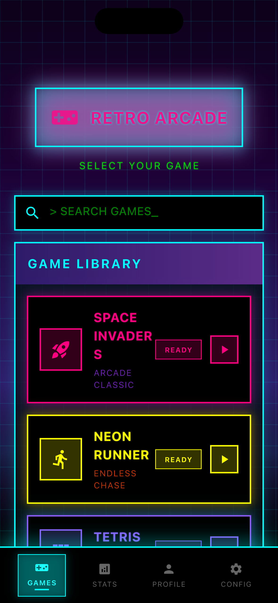
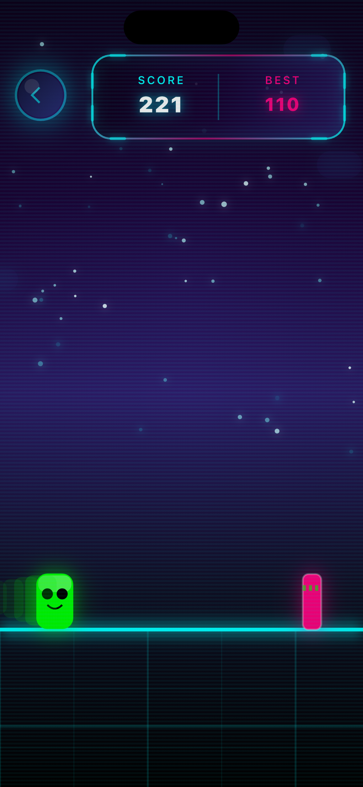
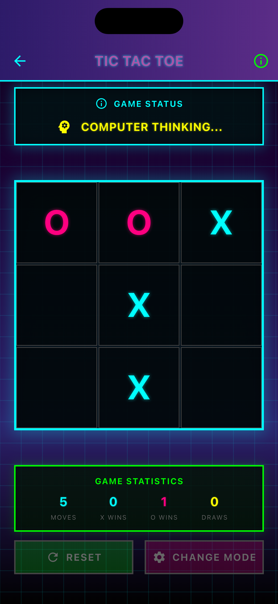
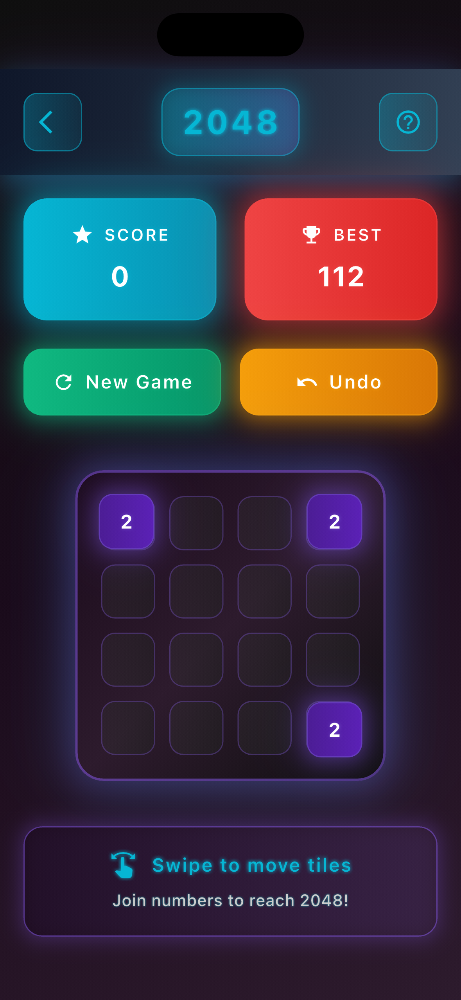
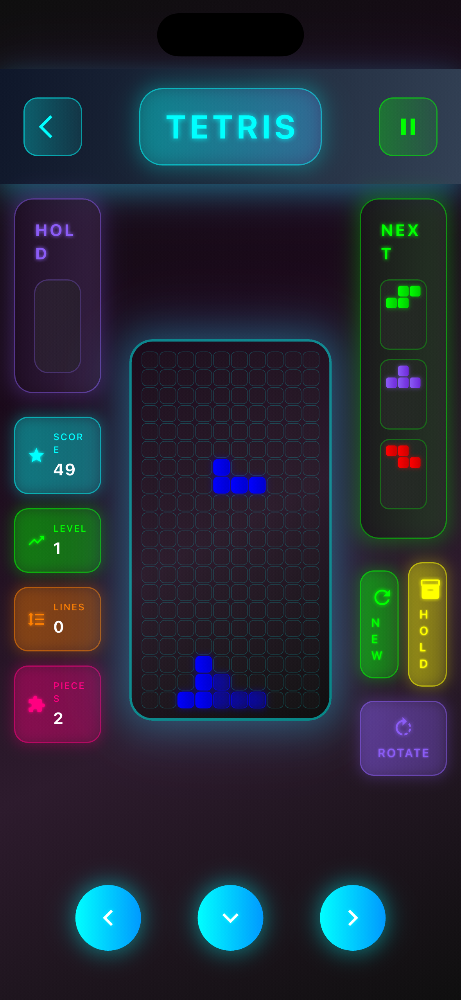
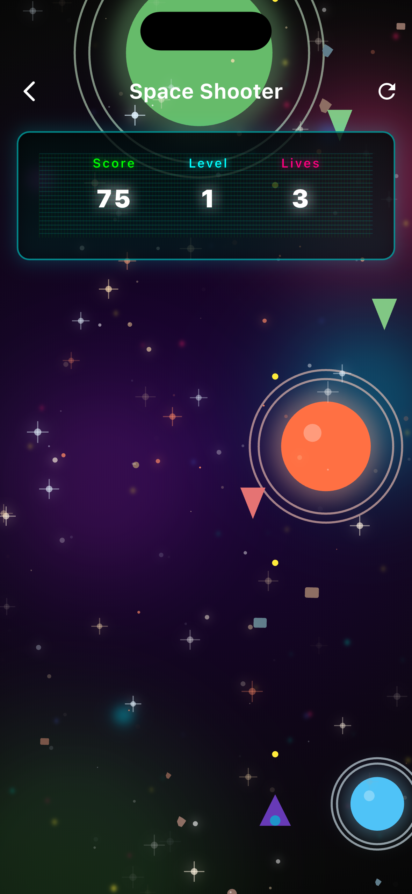

# Flutter Games Collection

A collection of classic arcade games built with Flutter, demonstrating advanced UI techniques and game development patterns.

## Demo Video

[](https://www.youtube.com/watch?v=TteFxaHuaSI)

[Watch the full demo video](https://www.youtube.com/watch?v=TteFxaHuaSI)

## Screenshots

<div align="center">
  <table>
    <tr>
      <td align="center">
        
        <br/>
        <sub><b>Home Screen</b></sub>
      </td>
      <td align="center">
        
        <br/>
        <sub><b>Endless Runner</b></sub>
      </td>
      <td align="center">
        
        <br/>
        <sub><b>Tic Tac Toe</b></sub>
      </td>
    </tr>
    <tr>
      <td align="center">
        
        <br/>
        <sub><b>2048 Puzzle</b></sub>
      </td>
      <td align="center">
        
        <br/>
        <sub><b>Tetris</b></sub>
      </td>
      <td align="center">
        
        <br/>
        <sub><b>Space Invaders</b></sub>
      </td>
    </tr>
  </table>
</div>

## Games Included

- **Endless Runner** - Chrome Dinosaur-inspired with jump/duck mechanics
- **Tic Tac Toe** - Human vs Human and Human vs AI with multiple difficulty levels
- **2048** - Classic sliding tile puzzle with smooth animations
- **Space Invaders** - Classic arcade shooter with wave-based enemy spawning
- **Tetris** - Falling block puzzle with line clearing mechanics
- **Cyber Quest** - RPG with character creation and class specialization

## Key Features

- 60fps rendering with optimized performance
- Cross-platform support (iOS, Android, Web, Desktop)
- Touch and keyboard input handling
- Score persistence and statistics
- Haptic feedback integration
- Modern Flutter UI with custom animations


## Getting Started

### Prerequisites

- Flutter SDK 3.0.0 or higher
- Dart SDK 2.17.0 or higher
- Android Studio or Xcode for mobile development
- Chrome browser for web development

### Installation

```bash
git clone https://github.com/Piyushhhhh/flutter-games.git
cd flutter-games
flutter pub get
flutter run
```

For web deployment:
```bash
flutter run -d chrome
```

## Controls

**Endless Runner:**
- Space/Tap: Jump
- Down Arrow/Hold: Duck

**Tic Tac Toe:**
- Tap: Place marker
- Menu: Select game mode

**2048:**
- Swipe: Move tiles
- Tap: Undo move

**Space Invaders:**
- Arrow Keys/Drag: Move ship
- Space/Tap: Fire weapon

**Tetris:**
- Swipe: Rotate/Move pieces
- Progressive difficulty scaling

**Cyber Quest:**
- Character creation and progression
- Multiple class specializations


## Technical Details

### Technology Stack

- **Flutter** 3.0+ - Primary UI framework
- **Dart** 2.17+ - Programming language
- **Custom Painters** - Advanced graphics rendering
- **Animation Controllers** - 60fps game loops
- **State Management** - Efficient game state handling

### Architecture

The project follows a clean MVC (Model-View-Controller) architecture:

- **Models** - Game state and data structures
- **Controllers** - Business logic and state management
- **Views** - UI components and user interactions
- **Painters** - Custom graphics rendering

### Platform Support

| Platform | Status | Notes |
|----------|--------|-------|
| Android | ✅ Supported | Optimized touch controls |
| iOS | ✅ Supported | Native haptic feedback |
| Web | ✅ Supported | Keyboard/mouse input |
| Windows | ✅ Supported | Desktop UI optimization |
| macOS | ✅ Supported | Native window management |
| Linux | ✅ Supported | GTK implementation |

## Roadmap

- Audio system integration
- Global leaderboards
- Additional games (Snake, Pac-Man)
- Multiplayer functionality
- Advanced analytics

## License

This project is licensed under the MIT License - see the [LICENSE](LICENSE) file for details.

## Contributing

Contributions are welcome! Please feel free to submit a Pull Request.

## Contact

- **Repository**: [https://github.com/Piyushhhhh/flutter-games](https://github.com/Piyushhhhh/flutter-games)
- **Issues**: [https://github.com/Piyushhhhh/flutter-games/issues](https://github.com/Piyushhhhh/flutter-games/issues)

