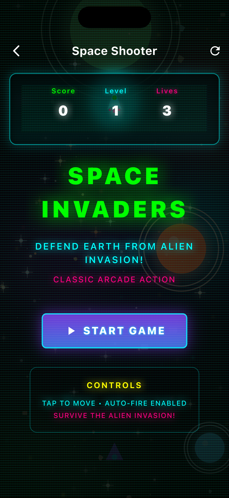

# 🎮 Flutter Games Collection

A modern collection of classic games built with Flutter, featuring retro-inspired neon aesthetics and smooth cross-platform gameplay.

## 🕹️ Games Included

### 🏃‍♂️ **Neon Runner** ⭐ *Latest*
- **Genre**: Endless Runner
- **Style**: Chrome Dinosaur-inspired
- **Features**: 
  - Jump and duck mechanics
  - Progressive difficulty
  - Obstacle avoidance (cactus, rocks, spikes)
  - Score tracking with high scores
  - Smooth 60fps gameplay
  - Neon visual effects
- **Controls**: 
  - **Mobile**: Tap to jump, hold to duck
  - **Desktop**: Space/Up Arrow to jump, Down Arrow to duck

### ❌⭕ **Tic Tac Toe**
- **Genre**: Strategy/Puzzle
- **Features**:
  - Human vs Human mode
  - Human vs AI mode
  - Multiple difficulty levels
  - Move history tracking
  - Statistics and win counters
  - Retro neon styling

### 🔢 **2048**
- **Genre**: Puzzle
- **Features**:
  - Classic 2048 gameplay
  - Smooth tile animations
  - Score tracking with best score
  - Undo functionality
  - Modern UI with neon accents
  - Responsive grid layout

### 🚀 **Space Invaders**
- **Genre**: Arcade Shooter
- **Features**:
  - Classic space shooter mechanics
  - Wave-based enemy spawning
  - Bullet physics
  - Progressive difficulty
  - Retro pixel art style
  - Touch and keyboard controls

### 🧩 **Tetris**
- **Genre**: Puzzle
- **Features**:
  - Classic falling blocks gameplay
  - Line clearing mechanics
  - Progressive speed increase
  - Score tracking
  - Modern neon styling

### 🧠 **Cyber Quest**
- **Genre**: RPG
- **Features**:
  - Character creation system
  - Multiple character classes (Hacker, Netrunner, Techie, Corporate)
  - Cyberpunk themed adventure
  - Stats and progression system

## 📸 Screenshots

### 🏠 Main Menu


### 🏃‍♂️ Neon Runner


### ❌⭕ Tic Tac Toe


### 🔢 2048


### 🧩 Tetris


### 🚀 Space Invaders



## ✨ Key Features

### 🎨 **Visual Design**
- **Retro-futuristic neon aesthetic** with glowing effects
- **Consistent UI theme** across all games
- **Smooth animations** and transitions
- **Responsive design** for multiple screen sizes
- **Dark theme** with cyan, magenta, and yellow accents

### ⚡ **Performance**
- **60fps gameplay** with optimized rendering
- **Smooth animations** using Flutter's animation framework
- **Efficient state management** with immutable game states
- **Cross-platform compatibility** (iOS, Android, Web, Desktop)

### 🎮 **Gameplay**
- **Intuitive controls** optimized for touch and keyboard
- **Progressive difficulty** in arcade-style games
- **Score persistence** and statistics tracking
- **Haptic feedback** for better user experience
- **Responsive touch controls** with proper gesture handling

## 🚀 Getting Started

### Prerequisites
- **Flutter SDK** (3.0.0 or higher)
- **Dart SDK** (2.17.0 or higher)
- **Android Studio** / **Xcode** (for mobile development)
- **Chrome** (for web development)

### Installation

1. **Clone the repository**
   ```bash
   git clone https://github.com/Piyushhhhh/flutter-games.git
   cd flutter-games
   ```

2. **Install dependencies**
   ```bash
   flutter pub get
   ```

3. **Run the app**
   ```bash
   # For mobile/desktop
   flutter run
   
   # For web
   flutter run -d chrome
   ```

### Build for Production

```bash
# Android APK
flutter build apk --release

# iOS (requires macOS and Xcode)
flutter build ios --release

# Web
flutter build web --release

# Desktop (Windows/macOS/Linux)
flutter build windows --release
flutter build macos --release
flutter build linux --release
```

## 🎯 Controls Guide

### 🏃‍♂️ Neon Runner
- **Jump**: Tap screen / Space / Up Arrow
- **Duck**: Hold screen / Down Arrow
- **Start/Restart**: Tap when game is stopped

### ❌⭕ Tic Tac Toe
- **Place Mark**: Tap on empty cell
- **Game Modes**: Select from main menu
- **Reset**: Use reset button in game

### 🔢 2048
- **Move Tiles**: Swipe in any direction
- **Undo**: Tap undo button
- **New Game**: Tap new game button

### 🚀 Space Invaders
- **Move**: Arrow keys / Drag on mobile
- **Shoot**: Space / Tap on mobile
- **Pause**: Escape key

## 🛠️ Technologies Used

- **Flutter** 3.0+ - UI framework
- **Dart** 2.17+ - Programming language
- **Custom Painters** - For game graphics and effects
- **Animation Controllers** - For smooth animations
- **State Management** - Using StatefulWidget and custom controllers
- **Ticker** - For 60fps game loops
- **Haptic Feedback** - For tactile user experience

## 📁 Project Structure

```
lib/
├── core/
│   ├── constants/          # App-wide constants
│   └── theme/             # Theme and styling
├── games/
│   ├── neon_runner/       # Endless runner game
│   ├── tic_tac_toe/       # Tic tac toe game
│   ├── game_2048/         # 2048 puzzle game
│   └── space_invaders/    # Space shooter game
├── models/                # Data models
├── screens/               # Main app screens
├── widgets/               # Reusable UI components
└── main.dart             # App entry point
```

### Game Architecture

Each game follows a consistent MVC-like pattern:

- **Models** (`*_models.dart`): Game state and data structures
- **Controllers** (`*_controller.dart`): Game logic and state management  
- **Views** (`*_screen.dart`): UI and user interaction
- **Painters** (`*_painter.dart`): Custom graphics rendering

## 🎨 Design Philosophy

This project embraces a **retro-futuristic aesthetic** inspired by:
- **80s arcade games** and neon signage
- **Tron-like** visual effects with glowing borders
- **Monospace fonts** for that classic computer feel
- **Dark themes** with bright accent colors
- **Grid patterns** and geometric shapes

## 🤝 Contributing

Contributions are welcome! Here's how you can help:

1. **Fork the repository**
2. **Create a feature branch** (`git checkout -b feature/new-game`)
3. **Make your changes** following the existing code style
4. **Add tests** if applicable
5. **Commit your changes** (`git commit -m 'Add new game: Snake'`)
6. **Push to the branch** (`git push origin feature/new-game`)
7. **Open a Pull Request**

### Adding a New Game

To add a new game to the collection:

1. Create a new folder in `lib/games/your_game/`
2. Follow the MVC pattern with these files:
   - `your_game_models.dart` - Game state and data
   - `your_game_controller.dart` - Game logic
   - `your_game_screen.dart` - UI implementation
   - `your_game_painter.dart` - Custom graphics (if needed)
3. Add navigation in `lib/screens/games_menu.dart`
4. Update this README with game details

## 📱 Platform Support

| Platform | Status | Notes |
|----------|---------|-------|
| **Android** | ✅ Supported | Optimized for touch controls |
| **iOS** | ✅ Supported | Native haptic feedback |
| **Web** | ✅ Supported | Keyboard and mouse controls |
| **Windows** | ✅ Supported | Desktop-optimized UI |
| **macOS** | ✅ Supported | Native window management |
| **Linux** | ✅ Supported | GTK-based implementation |

## 🐛 Known Issues

- Web version may have slightly reduced performance for intensive games
- Some mobile devices may experience input lag in high-speed gameplay
- Audio is not yet implemented (planned for future release)

## 🛣️ Roadmap

### Upcoming Features
- 🔊 **Sound effects** and background music
- 🏆 **Global leaderboards** and achievements
- 🎮 **More games**: Snake, Tetris, Pac-Man
- 🌐 **Multiplayer support** for competitive games
- 📊 **Advanced statistics** and gameplay analytics
- 🎨 **Customizable themes** and visual effects

### Version History
- **v1.2.0** - Added Neon Runner endless runner game
- **v1.1.0** - Enhanced 2048 with animations and help system
- **v1.0.0** - Initial release with Tic Tac Toe, 2048, and Space Invaders

## 📄 License

This project is licensed under the MIT License - see the [LICENSE](LICENSE) file for details.

## 🙏 Acknowledgments

- Inspired by classic arcade games and modern mobile gaming
- Flutter community for excellent documentation and examples
- Contributors and testers who helped improve the games
- Retro gaming aesthetic inspired by 80s arcade culture

## 📞 Contact

- **GitHub**: [Piyushhhhh](https://github.com/Piyushhhhh)
- **Issues**: [Report bugs here](https://github.com/Piyushhhhh/flutter-games/issues)

---

**Made with ❤️ and Flutter** 

*Enjoy gaming! 🎮*
